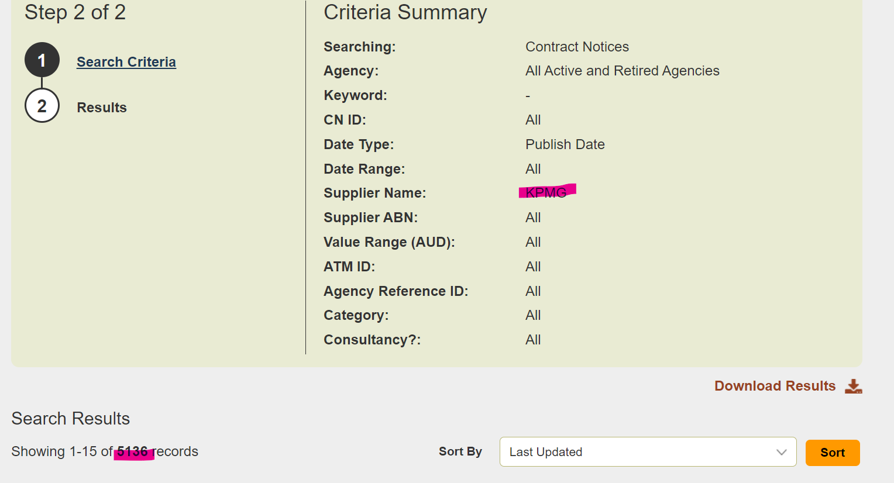

# Austender Summarizer
There is always news around how much the government spends on contracting. However it is hard
to find a quick summary of figures in a transparent manner without digging through Austender
website, so public service report or relying on journalists' scraping skills.

Serverless-first Go project that answers spend questions by organization/agency while persisting a reusable, partitioned Parquet lake for fast reuse.

## Features
- Collector CLI that scrapes OCDS releases and writes a partitioned Parquet lake with a SQLite catalog under `~/.cache/austender` (override via `AUSTENDER_CACHE_DIR`).
- Month- and FY-partitioned lake layout (`fy=YYYY-YY/month=YYYY-MM/agency=<key>/company=<key>`); fetcher skips months already present in the lake to avoid re-downloading.
- Server reuses collector logic and calls `RunSearchWithCache` by default, so API and MCP endpoints benefit from the lake and SQLite index.
- Chat-style HTMX frontend hitting `/api/llm` with an MCP toggle; toggle also controls cache prefetch.
- Temporal aggregate spend on raw AUD values (not inflation adjusted).
- Serverless-ready infra in AWS (CDK stack for Lambda + API Gateway + S3 + CloudFront).

## Roadmap and Status

- [x] Download one search result (e.g., KPMG) and verify totals (see docs image)
- [x] Basic web server API to serve results for a keyword: POST `/api/scrape` -> `{ result: "$X.XX" }`
- [x] Dual-mode server: local HTTP and AWS Lambda (API Gateway proxy) sharing the same scrape logic
- [x] Initial tests: server unit tests and infra assertions; helper scripts in `hack/`
- [x] Go multi-module layout (collector, server, infra) with direct reuse of collector in server
- [x] CI workflow to run tests across all components via `hack/test-all.sh`
- [x] Partitioned Parquet lake + SQLite catalog with month-level skip logic and reindex command
- [ ] Scheduled ingestion/cron to keep the lake warm
- [ ] Fuzzy name matching ("did you mean")
- [ ] Frontend build/deploy pipeline (upload to S3, CloudFront invalidation) and richer UI
- [ ] Performance, rate limiting, CORS, and basic auth hardening

Reference: https://github.com/golang-standards/project-layout

## Folder Structure

The repository is organized as follows:

- `collector/` – CLI and shared scraping logic; writes/reads the Parquet lake and SQLite catalog.
- `server/` – HTTP + Lambda entry that imports collector and defaults to cached lookups.
- `frontend/` – Static HTMX chat page with MCP toggle and cache prefetch control.
- `infra/` – AWS CDK stack for Lambda, API Gateway, S3, and CloudFront.
- `docs/` – Onboarding and screenshots.
- `hack/` – Helper scripts (`run-*`, `build-collector.sh`, `prime-datalake.sh`).
- `Taskfile.yml` – Aggregates component Taskfiles (collector/server/infra) and adds `collector:prime-lake` / `collector:build` convenience tasks.

Other files:
- `LICENSE.md` - License information.
- `Taskfile.yml` - Project-wide task automation.

## How to run locally

Prereqs: Go 1.25+, a browser. Optional: Task (https://taskfile.dev/#/installation).

- With Task (recommended):
    - Start API server: `task run:server`
    - Open frontend: `task run:frontend`
    - Start both: `task run:local`
    - Run all tests: `task test:all`
    - Build collector: `task collector:build`
    - Prime lake + reindex: `task collector:prime-lake -- --lookback-years 5` (filters optional; keyword/company/agency all optional)

- With plain scripts:
    - Start API server (localhost:8080): `bash hack/run-server.sh`
    - Open the minimal frontend: `bash hack/run-frontend.sh`
    - Start both: `bash hack/run-local.sh`
    - Build collector: `bash hack/build-collector.sh`
    - Prime lake + reindex: `bash hack/prime-datalake.sh --lookback-years 5` (filters optional)

API quick test (without frontend):
- POST to `http://localhost:8080/api/scrape` with JSON body `{"keyword":"KPMG"}`; response is `{ "result": "$X.XX" }`. Leave `keyword` empty to prime cache ranges.

LLM/MCP quick test:
- POST to `http://localhost:8080/api/llm` with `{ "prompt": "How much was spent by Department of Defence?", "prefetch": true }` to include cache context, or set `prefetch` false to skip collector queries. Attach `mcpConfig` JSON to allow the model to call tools.

### MCP-friendly chat frontend

- Open `frontend/index.html` (or run `task run:frontend`) and use the chat box to ask spend questions.
- Toggle “Enable MCP backend” to attach the MCP config from `frontend/config.local.js` to `/api/llm` calls. When off, the server also skips cache prefetch to isolate pure LLM responses.
- Responses include any prefetched cache context when the server can answer locally.

### Architecture (high level)
- Collector fetches OCDS releases by date windows, writes all matches (not just filtered ones) into a Parquet lake partitioned by FY/month/agency/company, and maintains a SQLite catalog. Windows with existing month partitions are skipped.
- Server imports collector and uses `RunSearchWithCache` by default for `/api/scrape` and `/api/llm` prefetch, so API calls leverage the lake without re-scraping.
- Frontend is a static HTMX chat page posting to `/api/llm` with an MCP toggle; MCP config allows downstream agents to call tools.
- Infra packages the server for Lambda/API Gateway and serves the static frontend via S3/CloudFront.

### Taskfile setup

- Root `Taskfile.yml` aggregates per-component Taskfiles via `includes`.
- Useful targets:
    - `task test:all` – runs tests across collector, server, infra.
    - `task run:server` – starts local API on :8080.
    - `task run:frontend` – opens the HTMX page.
    - `task run:local` – runs both.
- Component Taskfiles:
    - `collector/Taskfile.yml`: `task collector:test`, `task collector:tidy`.
    - `server/Taskfile.yml`: `task server:test`, `task server:build`, `task server:fastdeploy`.
    - `infra/Taskfile.yml`: `task infra:test`, `task infra:synth`, `task infra:deploy`, `task infra:destroy`.

## Allied MCP ideas for spend analysis

These MCPs pair well with the Austender tools to broaden government spend context:

- OpenSpending / Government Expenditure MCP: query consolidated budget or COFOG-classified spend datasets (e.g., GIFT/OKFN catalogs).
- USAspending MCP: pull US federal contract and assistance obligations for cross-jurisdiction comparisons.
- EU TED/Open Procurement MCP: fetch EU tender awards to benchmark vendor exposure across regions.
- Open Contracting Data Standard (OCDS) Registry MCP: discover and pull published OCDS releases from other jurisdictions for side-by-side analysis.
- Data.gov.au Budget/PAES MCP: surface Australian budget paper line items to compare appropriations vs. awarded contract spend.
