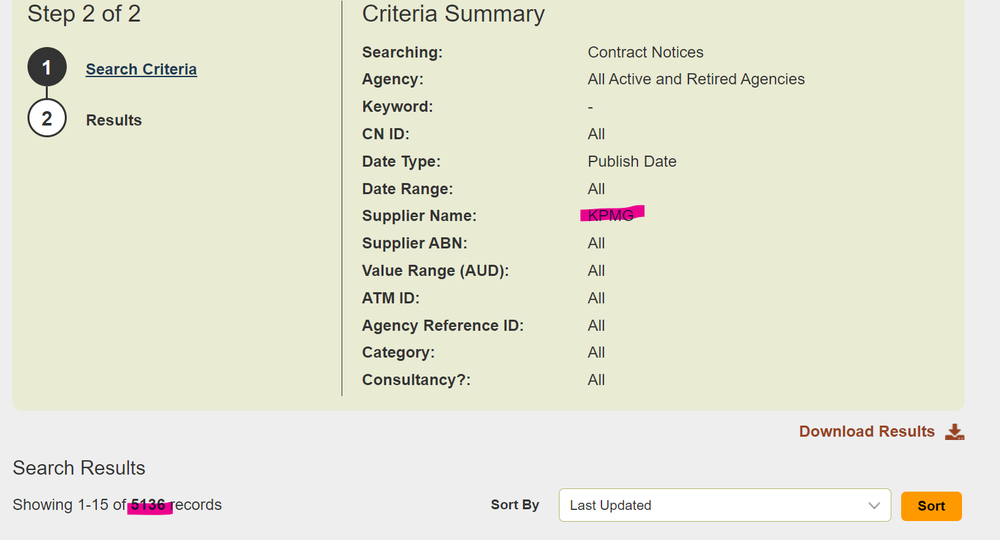

# Austender Analyser

Serverless-first Go stack that scrapes Australian government contract data, persists it in an auditable Parquet lake, and serves spend summaries via APIs, MCP tools, and a minimal chat frontend.

## Highlights
- Collector CLI streams OCDS releases into a partitioned Parquet lake with a ClickHouse-friendly JSON index under `~/.cache/austender` (override with `AUSTENDER_CACHE_DIR`).
- Dedicated adapters for federal, NSW, VIC, SA, and WA portals selectable via `--source`; each run skips month partitions already present in the lake.
- Server shares collector helpers, adds a same-day in-memory cache, and exposes REST, MCP, and LLM endpoints.
- Chat-style HTMX frontend targets `/api/llm`, auto-detects available LLM backends (OpenAI or Ollama), and can attach MCP configs on demand.
- Infrastructure-as-code stack (Go CDK) packages the API for Lambda+API Gateway and fronts the static site with S3+CloudFront.

## Roadmap Snapshot
- [x] Partitioned Parquet + ClickHouse-friendly index with reindex command
- [x] Dual-mode server (local HTTP + AWS Lambda)
- [x] MCP-aware `/api/llm` agent that can call collector tools (jurisdiction detection, entity lookup, contract aggregation)
- [x] Coverage harness via `task test:all` (collector, server, infra)
- [ ] Scheduled ingestion to keep the lake warm
- [ ] Production frontend pipeline (S3 upload + CloudFront invalidation)
- [ ] Harden auth, rate limits, and performance tunables

## Repository Layout
- `collector/` – Cobra CLI and shared scraping/cache logic reused by the server.
- `server/` – HTTP handlers, Lambda entry, LLM agent loop, and MCP bridge.
- `frontend/` – Static HTMX chat UI with MCP toggle and model picker.
- `infra/` – Go CDK stack for Lambda, API Gateway, S3, and CloudFront.
- `docs/` – Onboarding, testing strategy, and release notes.
- `hack/` – Shell scripts mirroring Taskfile targets for environments without Task.
- `Taskfile.yml` – Aggregates component Taskfiles and exposes repo-wide commands.

## Getting Started
Prerequisites: Go 1.25+, a browser, and optionally [Task](https://taskfile.dev/#/installation). AWS credentials are only required for infra work or Lambda deploys.

### Common Tasks (via Taskfile)
- Start API server on :8080: `task run:server`
- Launch chat frontend (assumes local API): `task run:frontend`
- Run both server + frontend helpers: `task run:local`
- Execute tests with coverage for all modules: `task test:all`
- Build collector binary into `dist/collector`: `task collector:build`
- Prime the Parquet lake and refresh catalog: `task collector:prime-lake -- --lookback-period 5`

### Shell Equivalents
- `bash hack/run-server.sh`
- `bash hack/run-frontend.sh`
- `bash hack/run-local.sh`
- `bash hack/build-collector.sh`
- `bash hack/prime-datalake.sh --lookback-period 5`

### Collector CLI Cheat Sheet
- Run ad-hoc scrape: `cd collector && go run . --k KPMG`
- Filter by company or agency: add `--c <company>` or `--d <agency>`
- Switch jurisdiction: append `--source federal|nsw|vic|sa|wa`
- Control date window: `--start-date YYYY-MM-DD`, `--end-date YYYY-MM-DD`, `--date-type contractPublished|contractStart|contractEnd|contractLastModified`
- Override lookback when no start provided: `--lookback-period <years>` (defaults to 20 or `AUSTENDER_LOOKBACK_PERIOD`)

### API Quick Tests
- `POST http://localhost:8080/api/scrape` with `{ "keyword": "KPMG" }` → `{ "result": "$X.XX" }`
- `POST http://localhost:8080/api/llm` with `{ "prompt": "How much was spent by Department of Defence?" }` → agent-driven answer; include `"source": "nsw"` or `"mcpConfig": {...}` as needed
- `GET http://localhost:8080/api/llm/models` → available model list and active backend metadata
- `POST http://localhost:8080/api/mcp` → invoke typed MCP tools programmatically (see `server/mcp_server.go`)

### Frontend Notes
- Open `frontend/index.html` directly or via `task run:frontend`
- Toggle **Enable MCP backend** to pass the config from `frontend/config.local.js`
- Status banner reflects detected backend (`openai` vs `ollama`) and surfaces model picker when Ollama is reachable

## Testing & Coverage
- `task test:all` runs module tests with coverage and merges profiles into `coverage/combined.out`
- Individual modules: `task collector:test`, `task server:test`, `task infra:test`
- Inspect coverage: `go tool cover -html=coverage/combined.out`

## Deployment

See [docs/DEPLOYMENT.md](docs/DEPLOYMENT.md) for the full deployment guide covering local development, Docker, AWS Serverless (Lambda + CloudFront), Fly.io, ECS Fargate, and CI/CD automation.

## Architecture Overview
- Collector streams OCDS releases into a lake partitioned by FY/month/agency/company; concurrent runs skip existing month partitions. Cache lives under `~/.cache/austender` unless overridden.
- Server normalizes requests into `collector.SearchRequest`, layers a same-day in-memory cache on top of the lake, and powers REST + MCP + LLM endpoints with consistent behavior.
- LLM handler wraps langchaingo, supports OpenAI and Ollama backends, and runs an internal tool-using agent capable of jurisdiction detection, catalog lookup, and contract aggregation.
- Frontend is static HTMX + Bootstrap; no build tooling required.
- Infra CDK stack provisions Lambda/API Gateway for the server, S3 bucket for the static assets, and CloudFront distribution secured via Origin Access Control.

## Related MCP Ideas
- OpenSpending / gov expenditure catalogs for complementary budget data
- USAspending, EU TED, or OCDS Registry MCPs for cross-jurisdiction comparisons
- Data.gov.au Budget/PAES MCP for juxtaposing appropriations vs contract spend
